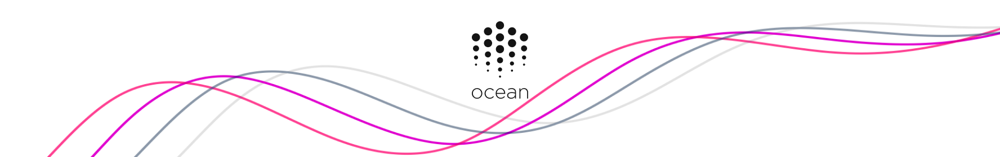

[](https://oceanprotocol.com)

<h1 align="center">art</h1>

> 🐬 Ocean Protocol's assets for community distribution.

[](https://www.npmjs.com/package/@oceanprotocol/art)

All assets in this repo can also be viewed and downloaded from [oceanprotocol.com/art](https://oceanprotocol.com/art). You'll find a living styleguide there too.

- [Repository Contents](#repository-contents)
- [Typography](#typography)
- [Usage](#usage)
  - [Use as npm package](#use-as-npm-package)
  - [Use as a submodule](#use-as-a-submodule)
  - [Usage in JavaScript/React](#usage-in-javascriptreact)
- [License](#license)

---

## Repository Contents

- [Logo](logo/)
- [Banner](banner/)
- [Jellyfish](jellyfish/)
- [Manta ray](mantaray/)
- [Squid](squid/)
- [GitHub](github/)

## Typography

Our branding typefaces are [Sharp Sans Medium/Bold](https://sharptype.co/typefaces/sharp-sans/#features) in use as body text, and [Sharp Sans Display No. 1 Bold](https://sharptype.co/typefaces/sharp-sans-display-no1/) for headings.

Those are commercial fonts and the license doesn't allow us to distribute them. Hence you won't find them in this repository. If you're a member of the Ocean Protocol team, ask a designer to hand you the font files.

If you only need them for use on the web, you can grab them from inside the private `site` repo's [fonts folder](https://github.com/oceanprotocol/site/tree/master/public/fonts).

## Usage

It's encouraged to use this repo as a dependency within your projects to keep the assets in sync.

### Use as npm package

The whole repo is published as a npm module so just run for installation:

```bash
npm i @oceanprotocol/art
```

### Use as a submodule

 From the root of your project folder execute the following to put the submodule under `lib/art/`:

```bash
git submodule add git@github.com:oceanprotocol/art.git lib/art
```

Then, from time to time, update the submodule to get latest upstream changes:

```bash
# go into submodule folder
cd ./lib/art
git checkout master
git pull
# get back to your project root
cd ../../

# or if you're a busy person, update all your submodules at once from the root of your project
git submodule foreach git pull origin master
```

### Usage in JavaScript/React

Import the required assets into your project, which will return the file source path:

```js
import Logo from '@oceanprotocol/art/logo/logo.svg'


```

But you usually want SVG assets to be inlined for full control over styling with CSS. To achieve that, you can incorporate [svgr](https://github.com/smooth-code/svgr) into your build process to import SVG assets as actual React components:

```js
import Logo from '@oceanprotocol/art/logo/logo.svg'

<Logo className="logo" />
```

And then style away in CSS:

```css
.logo {
    fill: #141414;
    stroke: none;
}
```

## License

All assets are licensed under a [Creative Commons Attribution-ShareAlike 4.0 International License](http://creativecommons.org/licenses/by-sa/4.0/).
